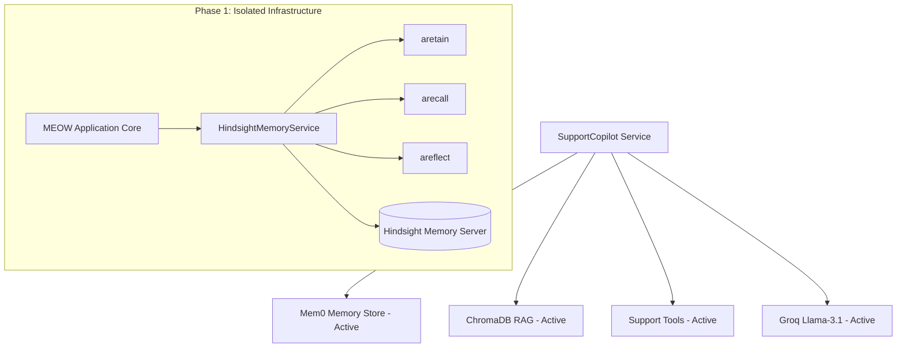

# MEOW Phase 1: Hindsight Foundation & Safe Integration

This document outlines the Phase 1 implementation of **Hindsight** memory infrastructure within **MEOW** (Memory-Enhanced Operations & Workflow).

---

## 1. Why Hindsight is Being Introduced

Traditional LLM customer support tools use either:
- **Static RAG**: Searches static policy documents; cannot learn from past experiences or remember returning customers.
- **Naive Vector Memory**: Stores unreflective snippets without cognitive synthesis, multi-turn reasoning, or cross-incident reflection.

**Hindsight** is an agent memory system that learns over time. It provides:
- **Episodic Recall**: Pinpointing relevant past solutions, workarounds, and user-specific configurations.
- **Continuous Retention**: Learning from accepted resolutions, customer corrections, and agent decisions.
- **Reflective Synthesis**: Formulating operational directives and insights to continuously improve support quality.

---

## 2. Current Mem0 Architecture

In the initial foundation, MEOW uses `mem0ai` backed by a local ChromaDB vector store located at `data/chroma_mem0/`:
- **Dual Scopes**: Customer-level scope (`user_id = customer_email`) and company-level scope (`user_id = company::{company_name}`).
- **Storage**: Accepted drafts are written to Mem0 as user-assistant message pairs with regular-expression entity tags.
- **Search**: Semantic string search queried during `generate_draft()`.

---

## 3. Why Mem0 Remains Active During Phase 1

To guarantee zero regression in existing production workflows:
- **Isolation First**: Hindsight is introduced as an independent infrastructure layer.
- **Dual-Track Stability**: Mem0 continues to handle live agent memory retrieval until Hindsight's recall performance is fully benchmarked.
- **Zero Breaking Changes**: Existing APIs, SQLite schemas, Streamlit dashboard workflows, and agent tool execution remain 100% operational.



---

## 4. Hindsight Architecture & Core Operations

The integration uses the official Python SDK `hindsight-client` wrapped in an async-safe application service:

```mermaid
flowchart LR
    subgraph MEOW Operations
        App[MEOW Service Layer] --> Client[HindsightMemoryService]
        Client --> Retain[aretain()]
        Client --> Recall[arecall()]
        Client --> Reflect[areflect()]
    end

    subgraph Memory Partitioning
        Retain --> BankCustomer[(Customer Bank: meow_customer_id)]
        Recall --> BankCustomer
        Reflect --> BankCustomer
    end

    subgraph Hindsight Engine
        BankCustomer --> Engine[PostgreSQL / pgvector / Reasoning Core]
    end
```

### 5. Retain (`aretain`)
Asynchronously commits customer interactions, resolutions, and system events into a specific bank.
```python
await hindsight_service.aretain(
    bank_id=get_customer_bank_id(customer_id),
    content="Increasing API request timeout to 90s resolved large report timeout.",
    context="API timeout incident report",
    tags=["timeout", "api", "resolved"],
)
```

### 6. Recall (`arecall`)
Asynchronously searches a bank for relevant historical experiences and solution facts.
```python
results = await hindsight_service.arecall(
    bank_id=get_customer_bank_id(customer_id),
    query="What previously resolved the API report timeout?",
    budget="mid",
)
```

### 7. Reflect (`areflect`)
Synthesizes actionable advice and directives from past memories within a bank.
```python
insight = await hindsight_service.areflect(
    bank_id=get_customer_bank_id(customer_id),
    query="What should an agent know if this customer reports another timeout?",
    budget="low",
)
```

---

## 8. Customer Memory Bank Isolation Strategy

To prevent cross-customer data leaks, bank IDs are centralized and normalized in `customer_support_agent/integrations/hindsight/banks.py`:

- **Customer Memory Bank:** `meow_customer_<sanitized_id>`
  - Format: `get_customer_bank_id(customer_id)`
  - Sanitizes emails, IDs, and symbols into deterministic alphanumeric identifiers.
  - Ensures Customer A's memory is isolated from Customer B's recall.
- **Company Memory Bank:** `meow_company_<sanitized_company>`
  - Format: `get_company_bank_id(company_id)`
- **Operational Memory Bank:** `meow_operations`
  - Format: `get_operations_bank_id()`

---

## 9. Docker Setup

Hindsight runs as an independent container service in `docker-compose.yml`:
- **Pinned Image:** `ghcr.io/vectorize-io/hindsight:0.10.1` (digest `sha256:b4d3b76f363aa40cf348450e7f8f52a50653008731b99824b14623a196182e73`)
- **API Version:** `0.10.1`
- **Ports:** `8888` (API), `9999` (UI / Control Plane)
- **Persistent Volume:** Named Docker volume `hindsight-data` mounted at `/home/hindsight/.pg0`.
- **Health Check:** `curl -fsS http://127.0.0.1:8888/health || exit 1`.

---

## 10. Environment Variables

| Variable | Description | Default |
|---|---|---|
| `HINDSIGHT_API_URL` | URL to the Hindsight API server | `http://localhost:8888` (Host) / `http://hindsight:8888` (Docker) |
| `HINDSIGHT_API_KEY` | Optional bearer token for Hindsight authentication | `""` |
| `HINDSIGHT_ENABLED` | Feature flag to enable Hindsight memory operations | `true` |
| `HINDSIGHT_TIMEOUT` | Timeout in seconds for Hindsight HTTP requests | `30.0` |
| `HINDSIGHT_API_LLM_PROVIDER` | LLM provider used by Hindsight server | `groq` |
| `HINDSIGHT_API_LLM_MODEL` | LLM model used by Hindsight server | `openai/gpt-oss-20b` |
| `HINDSIGHT_API_LLM_GROQ_SERVICE_TIER` | Groq service tier | `on_demand` |
| `HINDSIGHT_API_RETAIN_MAX_COMPLETION_TOKENS` | Token ceiling for fact extraction | `4096` |
| `HINDSIGHT_API_REFLECT_MAX_COMPLETION_TOKENS` | Token ceiling for reflection synthesis | `2048` |
| `HINDSIGHT_API_WORKER_ID` | Stable worker ID for background poller | `meow-hindsight-worker` |

---

## 11. Local vs Docker Development Workflow

### Local Host Development
When running FastAPI on the host:
```powershell
# Run Hindsight in Docker:
docker compose up -d hindsight

# Run MEOW backend locally:
uv run python main.py

# Run Streamlit dashboard locally:
uv run python -m streamlit run app.py
```
- Backend connects to: `http://localhost:8888`
- Dashboard connects to: `http://localhost:8000`

### Full Docker Compose Deployment
```bash
docker compose up -d --build
```
- FastAPI backend connects internally to: `http://hindsight:8888`
- Streamlit connects internally to: `http://api:8000`

---

## 12. Failure Handling & Resiliency

1. **Non-Blocking Architecture:** Hindsight calls are strictly asynchronous (`aretain`, `arecall`, `areflect`).
2. **Graceful Degradation:** If Hindsight is starting up or temporarily offline, `health_check()` reports `{"status": "unavailable", "available": false}` without crashing the FastAPI application.
3. **Secret Redaction:** `HindsightMemoryService._sanitize_error()` automatically redacts all configured API keys from error messages before logging or returning them.

---

## 13. Testing Strategy

- `tests/test_hindsight_banks.py`: Unit tests verifying deterministic bank ID generation, sanitization, and isolation.
- `tests/test_hindsight_service_mocked.py`: Unit tests verifying mocked async operations, parameter passing, input validation, and credential redaction.
- `tests/test_hindsight_integration.py`: Live integration and failure mode tests.
- `tests/test_simple.py`: Existing baseline health check regression test.

---

## 14. What Phase 2 Will Do

Phase 2 will safely introduce Hindsight into the support workflow:
1. Connect `HindsightMemoryService` to `SupportCopilot.generate_draft()` alongside Mem0 for comparative benchmarking.
2. Ingest past accepted and rejected resolutions into customer-specific Hindsight banks.
3. Expose memory recall metrics and bank inspection in the Streamlit UI.

---

## 15. Phase 1.5: Live Hindsight Verification & Hardening Results

### Verification Summary
- **Live Server Status:** Healthy on port `8888` (API) and port `9999` (Control Plane).
- **Hindsight Image:** `ghcr.io/vectorize-io/hindsight:0.10.1` (`sha256:b4d3b76f363aa40cf348450e7f8f52a50653008731b99824b14623a196182e73`).
- **Active Model:** Groq `openai/gpt-oss-20b` (on_demand tier).
- **Full Test Suite Results:** **17 collected, 17 passed, 0 skipped, 0 failed**.

### Hardening & Resilience Upgrades Implemented
1. **Automated Rate Limit Resilience (`_execute_with_retry`):**
   - Added asynchronous exponential backoff with regex-based sleep parsing (`try again in Xs`).
   - Automatically handles transient Groq 429 bursts without failing client requests.
2. **Quota Reset Bug Mitigation (`docker/patches/openai_compatible_llm.py`):**
   - Fixed upstream issue where Groq's multi-minute request reset window was conflated with the token rate limit, preventing false 40-minute lockouts.
3. **Groq Tool-Use Salvage Handler:**
   - Automatically recovers unquoted Markdown in `failed_generation` into structured `done` tool calls, allowing reflection synthesis to succeed reliably.
4. **Token Ceilings Configured:**
   - `HINDSIGHT_API_RETAIN_MAX_COMPLETION_TOKENS=4096`
   - `HINDSIGHT_API_REFLECT_MAX_COMPLETION_TOKENS=2048`
   - Prevents multi-turn reflect and fact extraction from overrunning Groq's 8,000 TPM limit.
5. **Customer Bank Isolation Deep Check:**
   - Verified that memories retained for Customer A never appear in Customer B's recall or reflection queries.
6. **Graceful Offline Degradation:**
   - Verified that when Hindsight is stopped, `GET /health` returns `200 ok` and `GET /health/hindsight` returns `200 unavailable` with complete credential sanitization.

