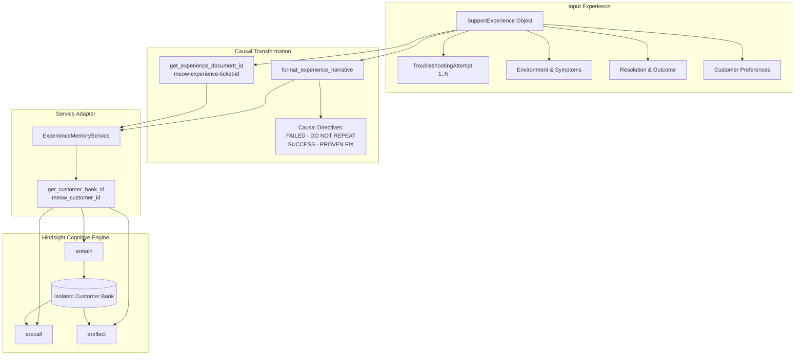
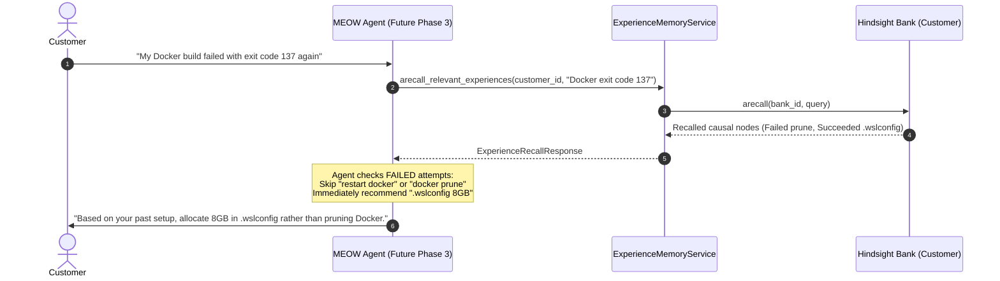

# MEOW Phase 2: Customer Experience Memory Layer

**MEOW — Memory-Enhanced Operations & Workflow**  
*Support that remembers.*

---

## 1. Executive Summary & Core Philosophy

In traditional customer support AI systems, memory is treated either as:
1. **Raw Conversation Logs**: Storing entire multi-turn transcripts, which contain noise, pleasantries, misunderstandings, and dead-ends.
2. **Flat Vector Semantic Snippets**: Chunking text into embeddings without understanding cause, effect, failure, or customer preferences.

When a customer encounters a recurring or related issue, naive systems often suggest the **exact same troubleshooting steps that already failed**, frustrating users and increasing Time-to-Resolution (TTR).

**MEOW Phase 2 introduces the Customer Experience Memory Layer**:
- **Causal Structure**: Separates what went wrong, what was tried, why it failed, what succeeded, and why it worked.
- **Negative Knowledge (Failure Awareness)**: Actively encodes failed attempts with `[FAILED - DO NOT REPEAT]` tags so the agent never repeats mistakes.
- **Positive Guidance (Proven Fixes)**: Highlights verified fixes with `[SUCCESS - PROVEN FIX]` directives.
- **Operational Preferences**: Retains customer preferences (e.g., CLI vs. GUI, notification preferences) to personalize every interaction.
- **Bank Isolation**: Strictly isolates each customer's memories into dedicated Hindsight banks (`meow_customer_{id}`).

---

## 2. Architecture & Data Flow



---

## 3. Pydantic Schemas

MEOW defines rigorous, strongly-typed domain models located in [`customer_support_agent/schemas/experience.py`](file:///c:/Users/samee/OneDrive/Desktop/xd/my%20projects/meow(microsoft)/customer_support_agent/schemas/experience.py):

### 3.1 `TroubleshootingAttempt`
Represents an individual action taken during troubleshooting, explicitly logging the outcome and causal rationale:
```python
class TroubleshootingAttempt(BaseModel):
    action: str           # e.g., "Restarted Docker Desktop"
    result: str           # e.g., "Failed with Exit code 137"
    reason: str | None    # e.g., "Did not increase WSL2 memory limit"
    timestamp: datetime | None

    @property
    def is_failure(self) -> bool: ...
    @property
    def is_success(self) -> bool: ...
```

### 3.2 `SupportExperience`
Captures the entire lifecycle of a customer support incident:
```python
class SupportExperience(BaseModel):
    experience_id: str
    customer_id: str
    company_id: str | None
    ticket_id: str | None
    problem: str
    environment: str | None
    symptoms: list[str]
    attempts: list[TroubleshootingAttempt]
    failed_attempts: list[TroubleshootingAttempt]
    successful_attempts: list[TroubleshootingAttempt]
    resolution: str | None
    outcome: str | None
    customer_reaction: str | None
    customer_sentiment: Literal["satisfied", "neutral", "frustrated", "escalated"] | None
    preferences: list[str]
    timestamp: datetime
    metadata: dict[str, Any]
```

#### Key Capabilities:
- **Auto-Partitioning**: When `attempts` are supplied, the model automatically partitions them into `failed_attempts` and `successful_attempts`.
- **Reverse Merge**: If `failed_attempts` and `successful_attempts` are supplied separately, they are merged into a chronologically ordered `attempts` list.
- **Incremental Logging**: The `.add_attempt(action, result, reason)` helper allows live recording of troubleshooting steps as the ticket progresses.

---

## 4. Causal Narrative Structuring

Hindsight's graph extraction algorithms perform best when relationships, causes, and consequences are explicit. The causal narrative generator (`format_experience_narrative`) formats structured experiences into markdown documents with standardized sections:

```markdown
=== SUPPORT EXPERIENCE REPORT ===
Customer ID: rahul_sharma
Ticket ID: 101

[PROBLEM REPORTED]
Docker Desktop build fails with Exit Code 137 OOM on Windows 11 WSL2

[ENVIRONMENT & CONFIGURATION]
Windows 11 Pro, WSL2

[OBSERVED SYMPTOMS]
- Exit code 137 during build
- High memory usage

[TROUBLESHOOTING & CAUSAL ATTEMPTS]
1. [FAILED - DO NOT REPEAT] Action: Restarted Docker and ran docker system prune
   Result: Failed with exit code 137 OOM
   Why it failed: Did not increase WSL2 virtual machine memory
2. [SUCCESS - PROVEN FIX] Action: Configured .wslconfig with memory=8GB and ran wsl --shutdown
   Result: Succeeded, build completed in 45s
   Why it succeeded: Allocated 8GB RAM to WSL2

[FINAL RESOLUTION]
Configured WSL2 memory=8GB in .wslconfig and restarted WSL2

[FINAL OUTCOME & IMPACT]
Container builds complete reliably

[CUSTOMER REACTION & SENTIMENT]
Reaction: Confirmed build works smoothly
Sentiment: satisfied

[CUSTOMER PREFERENCES & OPERATIONAL CONSTRAINTS]
- Prefers PowerShell CLI commands over GUI settings
```

---

## 5. Idempotent Retention & Document Identity

To avoid duplicate memory entries when a ticket is revised, updated, or re-processed, MEOW computes deterministic document IDs:
```python
def get_experience_document_id(experience: SupportExperience) -> str:
    if experience.ticket_id:
        return f"meow-experience-ticket-{experience.ticket_id.lower().strip()}"
    return f"meow-experience-{experience.experience_id.lower().strip()}"
```
When `aretain_experience` is called again for the same ticket, Hindsight recognizes the document ID and updates the knowledge graph rather than duplicating the memory.

---

## 6. Service API (`ExperienceMemoryService`)

The high-level service in [`customer_support_agent/integrations/hindsight/experience.py`](file:///c:/Users/samee/OneDrive/Desktop/xd/my%20projects/meow(microsoft)/customer_support_agent/integrations/hindsight/experience.py) provides four core capabilities:

| Method | Async / Sync | Description |
|---|---|---|
| `aretain_experience` / `retain_experience` | Both | Stores a `SupportExperience` with causal tags and metadata into the customer's bank. |
| `arecall_relevant_experiences` / `recall_relevant_experiences` | Both | Recalls past solutions and failed attempts for a given problem query. |
| `areflect_on_customer_experience` / `reflect_on_customer_experience` | Both | Generates synthesized advice regarding what worked, what failed, and recurring patterns. |
| `aretain_preference` / `retain_preference` | Both | Commits explicit customer operational constraints and preferences. |

### Failure-Aware Memory Retrieval Sequence



---

## 7. Multi-Tenant Bank Isolation

MEOW strictly separates customer memories into isolated Hindsight banks:
- **Customer Bank**: `meow_customer_{sanitized_customer_id}`
- **Company Bank**: `meow_company_{sanitized_company_id}`

### Bank Isolation Guarantees:
1. Querying Customer A's bank for Customer B's problem returns **zero** memories of Customer B.
2. Reflection on Customer A synthesizes **only** interactions belonging to Customer A.
3. Cross-tenant data leaks are prevented at the database and storage level within Hindsight.

---

## 8. Safe Dual-Track Integration (Production Stability)

In accordance with MEOW architectural principles:
- **Mem0 Remains 100% Active**: The production support copilot (`SupportCopilot.generate_draft()`) continues using Mem0 and ChromaDB for live customer draft generation.
- **Zero Breaking Changes**: Existing tests, endpoints, and Streamlit interfaces are completely untouched.
- **Phase 2 Status**: The Customer Experience Memory Layer is fully implemented, verified, and hardened as an independent service ready for dual-memory routing.

---

## 9. Phase 3 Roadmap: Dual-Memory Routing & Shadow Mode

In Phase 3, MEOW will connect the Customer Experience Memory Layer to the live support workflow:
1. **Dual-Memory Router**:
   - Query Mem0 for user identity & past chat message snippets.
   - Query Hindsight Experience Memory for causal fixes, failed steps, and system preferences.
2. **Shadow Mode Evaluation**:
   - Compare draft generation quality with Mem0-only vs. Mem0 + Hindsight Experience Memory.
   - Benchmark reduction in repeated failure recommendations.
3. **Memory Inspector UI**:
   - Visual dashboard in Streamlit allowing agents to view causal troubleshooting trees and customer preferences.
