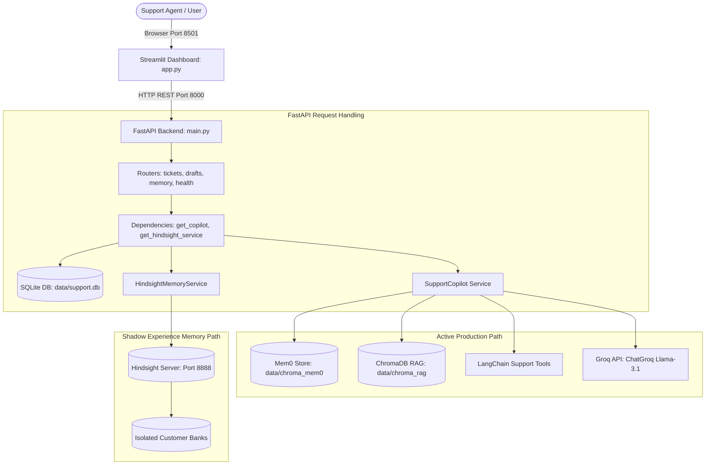

# MEOW System Architecture & Codebase Map

**MEOW — Memory-Enhanced Operations & Workflow**  
*Support that remembers.*  
**Author:** `s4meer-dev`  
**Phase:** 2.5 — Architecture & Codebase Map

---

## 1. Complete Repository Tree

```text
meow(microsoft)/
├── .github/
│   └── workflows/
│       ├── ci.yml                           # Automated GitHub Actions test CI pipeline
│       └── deploy-ec2.yml                   # AWS EC2 deployment automation workflow
├── app.py                                   # Streamlit frontend dashboard entrypoint
├── main.py                                  # FastAPI backend entrypoint
├── Dockerfile                               # Production multi-stage Docker build for API/Dashboard
├── docker-compose.yml                       # Multi-container orchestration (Hindsight, API, Dashboard)
├── pyproject.toml                           # Python project definition, dependencies, pytest configuration
├── uv.lock                                  # Locked dependency resolution file
├── .env.example                             # Environment variable template
├── .gitignore                               # Git exclusion rules
├── customer_support_agent/                  # Core application package
│   ├── __init__.py                          # Package root
│   ├── api/                                 # HTTP API layer
│   │   ├── __init__.py
│   │   ├── app_factory.py                   # FastAPI factory & lifespan setup
│   │   ├── dependencies.py                  # Dependency injection providers (repos, copilot, hindsight)
│   │   └── routers/                         # FastAPI route definitions
│   │       ├── __init__.py                  # Router exports
│   │       ├── health.py                    # /health, /health/hindsight, /debug/memory-flow
│   │       ├── tickets.py                   # /api/tickets (list, create, generate-draft)
│   │       ├── drafts.py                    # /api/drafts/{id} (get, update, accept, discard)
│   │       ├── knowledge.py                 # /api/knowledge (ingest, status)
│   │       └── memory.py                    # /api/customers/{id}/memories (list, search via Mem0)
│   ├── core/                                # Application configuration & settings
│   │   ├── __init__.py
│   │   └── settings.py                      # Pydantic Settings class & directory bootstrapping
│   ├── integrations/                        # External service integrations
│   │   ├── __init__.py
│   │   ├── hindsight/                       # Hindsight Engine Client & Experience Layer
│   │   │   ├── __init__.py                  # Hindsight exports
│   │   │   ├── banks.py                     # Tenant isolation & bank ID formatting rules
│   │   │   ├── client.py                    # SDK initialization & async healthcheck
│   │   │   ├── experience.py                # ExperienceMemoryService, Causal Narrative, Doc IDs
│   │   │   └── service.py                   # HindsightMemoryService (aretain, arecall, areflect)
│   │   ├── memory/                          # Active Production Memory (Mem0)
│   │   │   ├── __init__.py
│   │   │   └── mem0_store.py                # CustomerMemoryStore wrapping mem0.Memory
│   │   ├── rag/                             # Active Production RAG (ChromaDB)
│   │   │   ├── __init__.py
│   │   │   └── chroma_kb.py                 # KnowledgeBaseService wrapping ChromaDB PersistentClient
│   │   └── tools/                           # Support Agent Executable Tools
│   │       ├── __init__.py
│   │       └── support_tools.py             # LangChain tools (order lookup, status lookup)
│   ├── repositories/                        # Persistence Layer
│   │   ├── __init__.py
│   │   └── sqlite/                          # SQLite relational repositories
│   │       ├── __init__.py                  # Repository singleton exports
│   │       ├── base.py                      # DB connection factory & table initialization DDL
│   │       ├── customers.py                 # CustomersRepository CRUD
│   │       ├── tickets.py                   # TicketsRepository CRUD
│   │       └── drafts.py                    # DraftsRepository CRUD
│   ├── schemas/                             # Pydantic Data Contracts
│   │   ├── __init__.py                      # Schema exports
│   │   ├── api.py                           # HTTP Request/Response contracts (Tickets, Drafts, Memory)
│   │   └── experience.py                    # SupportExperience & TroubleshootingAttempt models
│   └── services/                            # Core Business Logic
│       ├── __init__.py
│       ├── copilot_service.py               # SupportCopilot (LangChain agent, Mem0, ChromaDB, Groq)
│       ├── draft_service.py                 # Draft serialization, background task orchestration
│       └── knowledge_service.py             # KnowledgeBase ingestion orchestration
├── data/                                    # Local filesystem data directory (persistent)
│   ├── support.db                           # SQLite database (customers, tickets, drafts)
│   ├── chroma_mem0/                         # ChromaDB vector store used by Mem0 (production memory)
│   └── chroma_rag/                          # ChromaDB vector store used by RAG (production knowledge)
├── docker/                                  # Docker patches & configurations
│   └── patches/
│       └── openai_compatible_llm.py         # Patched provider driver for Hindsight Groq compatibility
├── docs/                                    # Architectural and verification documentation
│   ├── EC2_deployment_flow.md               # AWS deployment runbook
│   ├── hindsight_phase_1.md                 # Phase 1 foundation documentation
│   ├── meow_experience_memory.md            # Phase 2 experience memory layer documentation
│   ├── meow_manual_verification.md          # Manual verification runbook
│   ├── meow_system_map.md                   # This codebase map
│   └── diagrams/                            # System architecture diagrams (.mmd)
├── knowledge_base/                          # Seed markdown policy documents for RAG
│   ├── banking-atm-cash-withdrawal-faq.md
│   ├── banking-charges-and-minimum-balance.md
│   ├── banking-kyc-and-account-update-rules.md
│   └── saving-account-rule.md
├── scripts/                                 # Verification & developer utilities
│   └── verify_experience_memory.py          # Deterministic demo fixture & experience CLI
└── tests/                                   # Automated test suite
    ├── conftest.py                          # Pytest fixtures and settings overrides
    ├── test_hindsight_banks.py              # Bank ID sanitization and tenant isolation tests
    ├── test_hindsight_experience.py         # SupportExperience schema, adapter & integration tests
    ├── test_hindsight_integration.py        # Hindsight live integration & failure mode tests
    ├── test_hindsight_service_mocked.py     # HindsightMemoryService mock tests
    └── test_simple.py                       # Base API health endpoint test
```

---

## 2. Directory Purpose, Ownership & Dependencies

| Directory | Purpose | Owner | Used By | Important Files |
|---|---|---|---|---|
| `customer_support_agent/api/` | Exposes REST HTTP endpoints for dashboard and external integrations | Backend API | Streamlit UI (`app.py`), Integration Tests | `app_factory.py`, `dependencies.py`, `routers/*.py` |
| `customer_support_agent/services/` | Contains core application orchestration logic | Core Services | API Routers (`tickets.py`, `drafts.py`) | `copilot_service.py`, `draft_service.py`, `knowledge_service.py` |
| `customer_support_agent/integrations/memory/` | Wraps Mem0 library for user-level episodic memory | Production Memory | `SupportCopilot` in `copilot_service.py` | `mem0_store.py` |
| `customer_support_agent/integrations/rag/` | Manages document chunking and vector search over policies | Production Knowledge | `SupportCopilot`, `knowledge.py` | `chroma_kb.py` |
| `customer_support_agent/integrations/hindsight/` | Isolated Hindsight client, causal adapter, and banks | Experience Memory (Shadow) | Diagnostic endpoint, `scripts/`, Tests | `experience.py`, `service.py`, `banks.py`, `client.py` |
| `customer_support_agent/repositories/sqlite/` | Relational storage for customers, tickets, and drafts | Persistence | API Routers, `DraftService` | `base.py`, `customers.py`, `tickets.py`, `drafts.py` |
| `customer_support_agent/schemas/` | Type definitions and validation models | Contracts | API Routers, Services, Tests | `api.py`, `experience.py` |
| `customer_support_agent/core/` | Global configuration, environment variables, paths | Settings | Entire Application | `settings.py` |
| `data/` | Local SQLite and ChromaDB database files | Storage | Repositories, Mem0, ChromaDB RAG | `support.db`, `chroma_mem0/`, `chroma_rag/` |
| `knowledge_base/` | Source markdown policy documents | Knowledge Base | `KnowledgeBaseService` | `banking-*.md` |
| `docker/patches/` | Hot-patches mounted into Hindsight container | Infrastructure | `meow-hindsight` container | `openai_compatible_llm.py` |
| `scripts/` | Standalone verification scripts | Developer Operations | Developers, CI/CD validation | `verify_experience_memory.py` |
| `tests/` | Pytest unit, mocked, and integration test suite | Quality Engineering | Developers, CI/CD (`ci.yml`) | `test_hindsight_*.py`, `test_simple.py` |

---

## 3. Application Startup Flows

### 3.1 FastAPI Backend Startup
- **Command:** `uv run python main.py` or `.venv/Scripts/python.exe main.py`
- **Entrypoint:** `main.py`
- **Application Factory:** `customer_support_agent.api.app_factory:create_app()`
- **Lifespan Execution:**
  1. `ensure_directories(resolved_settings)` creates `data/`, `data/chroma_mem0/`, `data/chroma_rag/`.
  2. `init_db()` executes table creation scripts in `data/support.db` (`customers`, `tickets`, `drafts`).
- **Registered Routers:**
  - `health_router`: `/health`, `/health/hindsight`, `/debug/memory-flow`
  - `tickets_router`: `/api/tickets`, `/api/tickets/{id}`, `/api/tickets/{id}/generate-draft`
  - `drafts_router`: `/api/drafts/{ticket_id}`, `/api/drafts/{draft_id}`
  - `knowledge_router`: `/api/knowledge/ingest`, `/api/knowledge/status`
  - `memory_router`: `/api/customers/{id}/memories`, `/api/customers/{id}/memory-search`

### 3.2 Streamlit Frontend Dashboard Startup
- **Command:** `uv run streamlit run app.py` or `.venv/Scripts/streamlit.exe run app.py`
- **Entrypoint:** `app.py`
- **Port:** `8501`
- **Backend Communication:** Communicates with FastAPI via synchronous HTTP requests (`requests.get`, `requests.post`, `requests.patch`) to `API_BASE_URL` (`http://localhost:8000`).

### 3.3 Docker Compose Architecture
- **Command:** `docker compose up -d`
- **Configured Services:**
  1. `hindsight` (`meow-hindsight`): Port `8888` (API) & `9999` (Console). Runs `ghcr.io/vectorize-io/hindsight:0.10.1` with patched `openai_compatible_llm.py`.
  2. `api` (`support-copilot-api`): Port `8000`. Runs FastAPI server.
  3. `dashboard` (`support-copilot-dashboard`): Port `8501`. Runs Streamlit UI. Depends on `api` healthy.



---

## 4. End-to-End User Request Trace: Ticket Draft Generation

This section traces a real user-facing support request line-by-line through the codebase:

```text
1. UI Interaction:
   User selects Ticket #1 and clicks "Generate Draft" in Streamlit dashboard.
   File: app.py
   Function: trigger_draft(ticket_id=1)
   Action: Sends HTTP POST http://localhost:8000/api/tickets/1/generate-draft

2. API Routing:
   File: customer_support_agent/api/routers/tickets.py
   Route: @router.post("/api/tickets/{ticket_id}/generate-draft")
   Function: generate_draft_route()
   Injected Dependencies:
     - tickets_repo: TicketsRepository
     - customers_repo: CustomersRepository
     - drafts_repo: DraftsRepository
     - draft_service: DraftService
     - copilot: SupportCopilot (via get_copilot_or_503)

3. Database Ticket & Customer Retrieval:
   File: customer_support_agent/repositories/sqlite/tickets.py -> get_by_id(1)
   File: customer_support_agent/repositories/sqlite/customers.py -> get_by_id(customer_id)

4. Draft Orchestration:
   File: customer_support_agent/services/draft_service.py
   Function: DraftService.generate_and_store_manual()
   Calls: copilot.generate_draft(ticket=ticket, customer=customer)

5. SupportCopilot Processing:
   File: customer_support_agent/services/copilot_service.py
   Function: SupportCopilot.generate_draft()
   
   A. Production Memory Retrieval (Mem0):
      Calls: self._search_memory_scopes()
      File: customer_support_agent/integrations/memory/mem0_store.py
      Function: CustomerMemoryStore.search(query, user_id=customer_email)
      Searches: data/chroma_mem0/
      Returns: Past resolutions and user preferences.
   
   B. Production Knowledge Retrieval (ChromaDB RAG):
      Calls: self.rag.search(query, top_k=settings.rag_top_k)
      File: customer_support_agent/integrations/rag/chroma_kb.py
      Function: KnowledgeBaseService.search()
      Searches: data/chroma_rag/
      Returns: Relevant policy chunks from knowledge_base/*.md.
   
   C. Prompt Construction:
      Calls: self._build_system_prompt(memory_hits, kb_hits)
      Calls: self._build_user_prompt(ticket, customer)
   
   D. LLM Execution:
      Calls: self._agent.invoke({"messages": [SystemMessage, HumanMessage]})
      Engine: LangChain create_agent + ChatGroq (groq_model="llama-3.1-8b-instant")
      Tool Execution: Executes support_tools (e.g., check_order_status) if needed.
   
   E. Context Extraction:
      Calls: self._extract_agent_draft_and_tool_calls()
      Calls: self._build_context()

6. Draft Persistence:
   File: customer_support_agent/repositories/sqlite/drafts.py
   Function: DraftsRepository.create(ticket_id=1, content=draft_text, context_used=json_str)

7. Response Serialization & UI Rendering:
   FastAPI returns JSON payload containing draft content and signals.
   Streamlit receives JSON, updates session state, and displays the editable draft, metrics, and context expander.
```

---

## 5. Active vs. Shadow Architecture Summary

| Component | Status | Connected To | Notes |
|---|---|---|---|
| **SupportCopilot** | **ACTIVE** | Mem0, ChromaDB, Groq LLM | Handles live ticket draft generation |
| **Mem0 (`CustomerMemoryStore`)** | **ACTIVE** | SupportCopilot, SQLite Drafts | Stores accepted drafts; recalled during draft generation |
| **ChromaDB (`KnowledgeBaseService`)** | **ACTIVE** | SupportCopilot, Knowledge Router | Stores policy documentation embeddings |
| **Hindsight (`ExperienceMemoryService`)** | **SHADOW / ISOLATED** | Diagnostics, Verification Scripts, Tests | Fully implemented and hardened; NOT connected to live draft loop |
